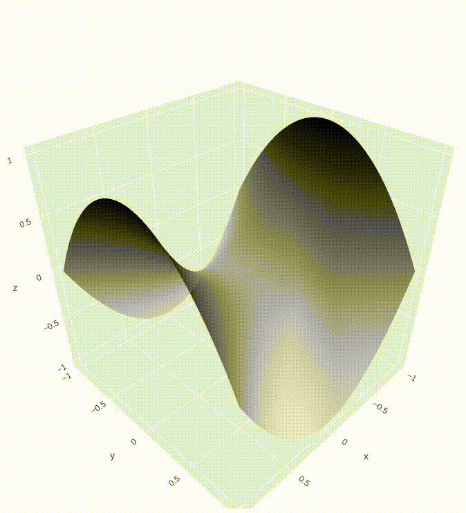

I have built this repository to show, in a didactic way,
the behavior of some of the best known optimization algorithms.
Specifically:

1. Stochastic Gradient Descent
2. Momentum
3. Nesterov
4. RMSProp
5. Adam

To compute the gradients of scalar functions I have employed 
the autograd library. For the visualizations, I have used plotly animations.
The gif below shows the behavior of the five algorithms in the proximity of a saddle point. 

